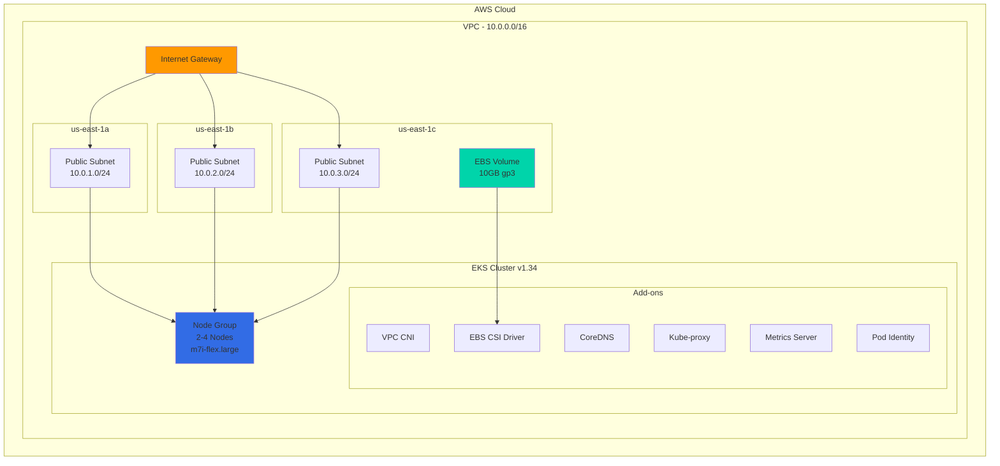

# 🚀 AWS EKS Infrastructure with Terraform

<div align="center">


**Production-Ready EKS Cluster Infrastructure**

[Features](#-features) • [Architecture](#-architecture) • [Quick Start](#-quick-start) • [Documentation](#-documentation)

</div>

---

## 📖 Overview

This repository contains **Infrastructure as Code (IaC)** using Terraform to provision a complete AWS EKS cluster environment. The infrastructure is designed for production workloads with high availability, security, and scalability in mind.

### 🎯 What's Included

```
✅ Custom VPC with Multi-AZ Subnets
✅ EKS Cluster (Kubernetes 1.34)
✅ Managed Node Groups (Auto-scaling)
✅ Security Groups & IAM Roles
✅ EBS CSI Driver for Persistent Storage
✅ Essential EKS Add-ons
✅ OIDC Provider for Service Accounts
```

---

## ✨ Features

<table>
<tr>
<td width="50%">

### 🌐 Networking
- **VPC** with CIDR 10.0.0.0/16
- **3 Public Subnets** across different AZs
- **Internet Gateway** for external connectivity
- **Route Tables** with proper associations

</td>
<td width="50%">

### 🔐 Security
- **Security Groups** (SSH, HTTP, HTTPS, Custom Ports)
- **IAM Roles** for Cluster & Nodes
- **OIDC Provider** for secure authentication
- **Network isolation** between resources

</td>
</tr>
<tr>
<td width="50%">

### ☸️ Kubernetes
- **EKS v1.34** with latest features
- **2-4 Worker Nodes** (Auto-scaling)
- **6 Essential Add-ons** pre-configured
- **m7i-flex.large** instances

</td>
<td width="50%">

### 💾 Storage
- **EBS CSI Driver** for dynamic provisioning
- **10GB EBS Volume** (gp3 type)
- **Persistent Volume** support
- **Snapshot capabilities**

</td>
</tr>
</table>

---

## 🏗️ Architecture



---

## 📦 Resources Created

| Resource Type | Count | Details |
|--------------|-------|---------|
| 🌐 **VPC** | 1 | 10.0.0.0/16 CIDR block |
| 🔌 **Subnets** | 3 | Public subnets in 3 AZs |
| 🚪 **Internet Gateway** | 1 | For external connectivity |
| 📋 **Route Tables** | 1 | With IGW route + 3 associations |
| 🔒 **Security Groups** | 1 | Ports: 22, 80, 443, 8080, 32000, 50000 |
| ☸️ **EKS Cluster** | 1 | Kubernetes v1.34 |
| 🖥️ **Node Groups** | 1 | 2-4 m7i-flex.large instances |
| 🔑 **IAM Roles** | 3 | Cluster, Nodes, EBS CSI Driver |
| 📦 **EKS Add-ons** | 6 | VPC CNI, CoreDNS, Kube-proxy, Metrics, CSI, Pod Identity |
| 💾 **EBS Volume** | 1 | 10GB gp3 in us-east-1c |
| 🔐 **OIDC Provider** | 1 | For service account authentication |

---

## 🚀 Quick Start

### Prerequisites

Before you begin, ensure you have:

### Installation Steps

#### 1️⃣ Clone the Repository

```bash
git clone https://github.com/Mohamed-Sarhan-Elhussieny/AWS-EKS-Core-Infrastructure-with-Terraform-depi-.git
cd AWS-EKS-Core-Infrastructure-with-Terraform-depi
```

#### 2️⃣ Initialize Terraform

```bash
terraform init
```

<details>
<summary>📸 Expected Output</summary>

```
Initializing the backend...
Initializing provider plugins...
- Finding hashicorp/aws versions matching "~> 6.0"...
- Installing hashicorp/aws v6.x.x...

Terraform has been successfully initialized!
```
</details>

#### 3️⃣ Review the Plan

```bash
terraform plan
```

This will show you all resources that will be created.

#### 4️⃣ Apply Configuration

```bash
terraform apply
```

Type `yes` when prompted. ⏱️ This takes approximately **10-15 minutes**.

#### 5️⃣ Configure kubectl

```bash
aws eks update-kubeconfig --region us-east-1 --name cluster
```

#### 6️⃣ Verify Cluster

```bash
kubectl get nodes
kubectl get pods -A
```

---

## 📊 Infrastructure Details

### VPC Configuration

```hcl
VPC CIDR:        10.0.0.0/16
Subnet 1 (1a):   10.0.1.0/24  [Public]
Subnet 2 (1b):   10.0.2.0/24  [Public]
Subnet 3 (1c):   10.0.3.0/24  [Public]
```

### EKS Cluster Specifications

| Parameter | Value |
|-----------|-------|
| **Kubernetes Version** | 1.34 |
| **Instance Type** | m7i-flex.large |
| **AMI Type** | AL2023_x86_64_STANDARD |
| **Capacity Type** | ON_DEMAND |
| **Disk Size** | 20 GB |
| **Min Nodes** | 2 |
| **Max Nodes** | 4 |
| **Desired Nodes** | 2 |

### Security Group Rules

| Port | Protocol | Purpose |
|------|----------|---------|
| 22 | TCP | SSH Access |
| 80 | TCP | HTTP Traffic |
| 443 | TCP | HTTPS Traffic |
| 8080 | TCP | Jenkins UI |
| 32000 | TCP | NodePort Service |
| 50000 | TCP | Jenkins Agent |

---

## 🔧 Configuration

### 🎨 Customization Options

You can modify these values in the Terraform files:

```hcl
# Region
region = "us-east-1"

# VPC CIDR
vpc_cidr = "10.0.0.0/16"

# EKS Cluster Name
cluster_name = "cluster"

# Node Configuration
instance_type = "m7i-flex.large"
desired_size  = 2
max_size      = 4
min_size      = 2

# Kubernetes Version
k8s_version = "1.34"
```

### 📤 Outputs

After deployment, Terraform provides:

```bash
# View all outputs
terraform output

# Specific outputs
terraform output jenkins_volume_info
terraform output eks_cluster_info
```

**Available Outputs:**
- `jenkins_volume_info` - EBS volume ID and availability zone
- `eks_cluster_info` - EKS cluster name and ARN

---

### Key Components

<details>
<summary><b>🌐 VPC & Networking</b></summary>

- **VPC**: Custom VPC with DNS support
- **Subnets**: 3 public subnets for high availability
- **Internet Gateway**: Enables internet access
- **Route Tables**: Configured with IGW routes
- **Auto-assign Public IP**: Enabled on all subnets

</details>

<details>
<summary><b>☸️ EKS Cluster</b></summary>

- **Authentication Mode**: API
- **Endpoint Access**: Public
- **Platform Version**: Latest
- **Add-ons**: 6 essential add-ons pre-installed

</details>

<details>
<summary><b>🔐 IAM & Security</b></summary>

- **Cluster Role**: For EKS cluster operations
- **Node Role**: For worker node operations
- **EBS CSI Role**: For persistent volume management
- **OIDC Provider**: For Kubernetes service accounts

</details>

<details>
<summary><b>💾 Storage</b></summary>

- **EBS CSI Driver**: Enabled for dynamic provisioning
- **Storage Class**: gp2/gp3 support
- **Volume**: 10GB gp3 in us-east-1c

</details>

---


## 🔗 Related Resources

- 🔗 [Kubernetes Manifests Repository](https://github.com/your-username/EKS-Jenkins-CICD-Kubernetes-Manifests-depi) - Deploy Jenkins CI/CD
- 📚 [AWS EKS Documentation](https://docs.aws.amazon.com/eks/)
- 📚 [Terraform AWS Provider](https://registry.terraform.io/providers/hashicorp/aws/latest/docs)
- 📚 [Kubernetes Documentation](https://kubernetes.io/docs/)

---

## 📜 License

This project is licensed under the MIT License - see the [LICENSE](LICENSE) file for details.

---

## 👤 Author

**Mohamed-Sarhan-Elhussieny**

⭐ **Star this repo** if you find it helpful!

---

<div align="center">

**Built with ❤️ using Terraform & AWS**


</div>
