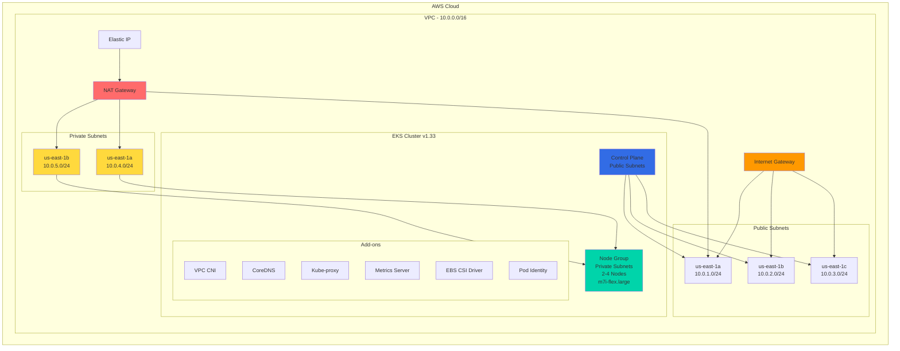

# 🚀 AWS EKS Infrastructure with Terraform

<div align="center">


**Production-Ready EKS Cluster Infrastructure**

[Features](#-features) • [Architecture](#-architecture) • [Quick Start](#-quick-start) • [Documentation](#-documentation)

</div>

---

## 📖 Overview

This repository contains **Infrastructure as Code (IaC)** using Terraform to provision a complete AWS EKS cluster environment. The infrastructure is designed for production workloads with high availability, security, and scalability in mind.

### 🎯 What's Included

```
✅ Custom VPC with Multi-AZ Subnets (Public & Private)
✅ EKS Cluster (Kubernetes 1.33)
✅ Managed Node Groups (Auto-scaling)
✅ NAT Gateway for Private Subnet Internet Access
✅ Security Groups & IAM Roles
✅ EBS CSI Driver for Persistent Storage
✅ Essential EKS Add-ons
✅ OIDC Provider for Service Accounts
```

---

## ✨ Features

<table>
<tr>
<td width="50%">

### 🌐 Networking
- **VPC** with CIDR 10.0.0.0/16
- **3 Public Subnets** across different AZs
- **2 Private Subnets** for worker nodes
- **Internet Gateway** for external connectivity
- **NAT Gateway** for private subnet outbound traffic
- **Route Tables** with proper associations

</td>
<td width="50%">

### 🔐 Security
- **Security Groups** (SSH, HTTP, HTTPS, Jenkins, Grafana, Prometheus)
- **IAM Roles** for Cluster, Nodes & EBS CSI
- **OIDC Provider** for secure authentication
- **Network isolation** with private subnets

</td>
</tr>
<tr>
<td width="50%">

### ☸️ Kubernetes
- **EKS v1.33** with latest features
- **2-4 Worker Nodes** (Auto-scaling)
- **6 Essential Add-ons** pre-configured
- **m7i-flex.large** instances
- **API_AND_CONFIG_MAP** authentication mode

</td>
<td width="50%">

### 💾 Storage
- **EBS CSI Driver** for dynamic provisioning
- **IRSA (IAM Roles for Service Accounts)** enabled
- **Persistent Volume** support
- **Snapshot capabilities**

</td>
</tr>
</table>

---

## 🏗️ Architecture



---

## 📦 Resources Created

| Resource Type | Count | Details |
|--------------|-------|---------|
| 🌐 **VPC** | 1 | 10.0.0.0/16 CIDR block |
| 🔌 **Public Subnets** | 3 | In us-east-1a, 1b, 1c |
| 🔒 **Private Subnets** | 2 | In us-east-1a, 1b (for nodes) |
| 🚪 **Internet Gateway** | 1 | For external connectivity |
| 🔀 **NAT Gateway** | 1 | For private subnet outbound traffic |
| 💎 **Elastic IP** | 1 | Attached to NAT Gateway |
| 📋 **Route Tables** | 2 | Public + Private with associations |
| 🔒 **Security Groups** | 1 | Ports: 22, 80, 443, 3000, 9090, 32000, 50000 |
| ☸️ **EKS Cluster** | 1 | Kubernetes v1.33 |
| 🖥️ **Node Groups** | 1 | 2-4 m7i-flex.large instances in private subnets |
| 🔑 **IAM Roles** | 3 | Cluster, Nodes, EBS CSI Driver |
| 📦 **EKS Add-ons** | 6 | VPC CNI, CoreDNS, Kube-proxy, Metrics, CSI, Pod Identity |
| 💾 **EBS Volume** | 1 | 10GB gp3 in us-east-1c (for Jenkins) |
| 🔐 **OIDC Provider** | 1 | For service account authentication (IRSA) |

---

## 📚 Documentation

### 📁 Project Structure

```
eks-terraform-infrastructure/
├── .gitignore                  # Git ignore rules
├── README.md                   # Project documentation
├── provider.tf                 # AWS provider configuration
├── Network.tf                  # VPC, subnets, IGW, NAT, route tables
├── security-groups.tf          # Security group definitions
├── iam_roles.tf                # IAM roles for cluster and nodes
├── iam-ebs-csi-irsa.tf         # OIDC provider and EBS CSI driver IAM role
├── eks-cluster.tf              # EKS cluster and add-ons configuration
├── eks-node-group.tf           # EKS worker node group
├── ebs-volume.tf               # EBS volume for Jenkins persistent storage
└── output.tf                   # Terraform output values
```

### 📄 File Descriptions

<table>
<tr>
<th>File</th>
<th>Purpose</th>
<th>Key Resources</th>
</tr>

<tr>
<td><code>provider.tf</code></td>
<td>Configures AWS provider and required Terraform version</td>
<td>
• AWS Provider v6.0<br>
• Region: us-east-1
</td>
</tr>

<tr>
<td><code>Network.tf</code></td>
<td>Defines all networking infrastructure</td>
<td>
• VPC (10.0.0.0/16)<br>
• 3 Public Subnets<br>
• 2 Private Subnets<br>
• Internet Gateway<br>
• NAT Gateway + Elastic IP<br>
• Public & Private Route Tables<br>
• Route Associations
</td>
</tr>

<tr>
<td><code>security-groups.tf</code></td>
<td>Security group rules for cluster and nodes</td>
<td>
• Ingress: 22, 80, 443, 3000, 9090, 32000, 50000<br>
• Egress: All traffic<br>
• Supports Jenkins, Grafana, Prometheus
</td>
</tr>

<tr>
<td><code>iam_roles.tf</code></td>
<td>IAM roles for EKS cluster and worker nodes</td>
<td>
• EKS Cluster Role<br>
• EKS Node Role<br>
• Policy Attachments (Worker, CNI, ECR)
</td>
</tr>

<tr>
<td><code>iam-ebs-csi-irsa.tf</code></td>
<td>IAM roles and OIDC provider for service accounts (IRSA)</td>
<td>
• OIDC Provider with TLS Certificate<br>
• EBS CSI Driver IAM Role<br>
• IAM Policy Attachments<br>
• Service Account Integration
</td>
</tr>

<tr>
<td><code>eks-cluster.tf</code></td>
<td>EKS cluster configuration and essential add-ons</td>
<td>
• EKS Cluster v1.33<br>
• VPC CNI v1.20.4<br>
• CoreDNS v1.12.3<br>
• Kube-proxy v1.33.5<br>
• Metrics Server v0.8.0<br>
• EBS CSI Driver v1.53.0<br>
• Pod Identity Agent v1.3.9<br>
• API_AND_CONFIG_MAP auth mode
</td>
</tr>

<tr>
<td><code>eks-node-group.tf</code></td>
<td>Managed node group with auto-scaling in private subnets</td>
<td>
• Instance Type: m7i-flex.large<br>
• AMI: AL2023_x86_64_STANDARD<br>
• Scaling: 2-4 nodes<br>
• Disk: 20GB<br>
• Capacity: ON_DEMAND<br>
• Located in Private Subnets
</td>
</tr>

<tr>
<td><code>ebs-volume.tf</code></td>
<td>Creates persistent EBS volume for Jenkins</td>
<td>
• Volume: 10GB gp3<br>
• AZ: us-east-1c<br>
• Used for Jenkins data persistence
</td>
</tr>

<tr>
<td><code>output.tf</code></td>
<td>Defines Terraform output values</td>
<td>
• Jenkins volume info (ID, AZ, size, type)<br>
• EKS cluster info (name, ARN, endpoint, version)
</td>
</tr>

<tr>
<td><code>.gitignore</code></td>
<td>Specifies files Git should ignore</td>
<td>
• terraform.tfstate<br>
• .terraform/<br>
• *.tfvars<br>
• Sensitive files
</td>
</tr>
</table>
</table>

---

## 🚀 Quick Start

### Prerequisites

Before you begin, ensure you have:

- ✅ **Terraform** >= 1.0 installed
- ✅ **AWS CLI** configured with credentials
- ✅ **kubectl** installed
- ✅ **IAM permissions** to create VPC, EKS, IAM roles

### Installation Steps

#### 1️⃣ Clone the Repository

```bash
git clone https://github.com/Mohamed-Sarhan-Elhussieny/AWS-EKS-Core-Infrastructure-with-Terraform-depi-.git
cd AWS-EKS-Core-Infrastructure-with-Terraform-depi
```

#### 2️⃣ Initialize Terraform

```bash
terraform init
```

<details>
<summary>📸 Expected Output</summary>

```
Initializing the backend...
Initializing provider plugins...
- Finding hashicorp/aws versions matching "~> 6.0"...
- Installing hashicorp/aws v6.x.x...

Terraform has been successfully initialized!
```
</details>

#### 3️⃣ Review the Plan

```bash
terraform plan
```

This will show you all resources that will be created.

#### 4️⃣ Apply Configuration

```bash
terraform apply
```

Type `yes` when prompted. ⏱️ This takes approximately **10-15 minutes**.

#### 5️⃣ Configure kubectl

```bash
aws eks update-kubeconfig --region us-east-1 --name cluster
```

#### 6️⃣ Verify Cluster

```bash
kubectl get nodes
kubectl get pods -A
```

---

## 📊 Infrastructure Details

### VPC Configuration

```hcl
VPC CIDR:           10.0.0.0/16

Public Subnets:
  Subnet 1 (1a):    10.0.1.0/24  [Public]
  Subnet 2 (1b):    10.0.2.0/24  [Public]
  Subnet 3 (1c):    10.0.3.0/24  [Public]

Private Subnets:
  Subnet 4 (1a):    10.0.4.0/24  [Private - Worker Nodes]
  Subnet 5 (1b):    10.0.5.0/24  [Private - Worker Nodes]
```

### EKS Cluster Specifications

| Parameter | Value |
|-----------|-------|
| **Kubernetes Version** | 1.33 |
| **Authentication Mode** | API_AND_CONFIG_MAP |
| **Bootstrap Admin** | Enabled |
| **Instance Type** | m7i-flex.large |
| **AMI Type** | AL2023_x86_64_STANDARD |
| **Capacity Type** | ON_DEMAND |
| **Disk Size** | 20 GB |
| **Min Nodes** | 2 |
| **Max Nodes** | 4 |
| **Desired Nodes** | 2 |
| **Node Location** | Private Subnets |
| **Control Plane** | Public Subnets |

### Add-ons Versions

| Add-on | Version |
|--------|---------|
| VPC CNI | v1.20.4-eksbuild.1 |
| Kube-proxy | v1.33.5-eksbuild.2 |
| CoreDNS | v1.12.3-eksbuild.1 |
| Metrics Server | v0.8.0-eksbuild.3 |
| EBS CSI Driver | v1.53.0-eksbuild.1 |
| Pod Identity Agent | v1.3.9-eksbuild.5 |

### Security Group Rules

| Port | Protocol | Purpose |
|------|----------|---------|
| 22 | TCP | SSH Access |
| 80 | TCP | HTTP Traffic |
| 443 | TCP | HTTPS Traffic |
| 3000 | TCP | Grafana Dashboard |
| 9090 | TCP | Prometheus |
| 32000 | TCP | NodePort Service |
| 50000 | TCP | Jenkins Agent |

---

## 🔧 Configuration

### 🎨 Customization Options

You can modify these values in the Terraform files:

```hcl
# Region
region = "us-east-1"

# VPC CIDR
vpc_cidr = "10.0.0.0/16"

# Subnet CIDRs
public_subnets  = ["10.0.1.0/24", "10.0.2.0/24", "10.0.3.0/24"]
private_subnets = ["10.0.4.0/24", "10.0.5.0/24"]

# EKS Cluster Name
cluster_name = "cluster"

# Node Configuration
instance_type = "m7i-flex.large"
desired_size  = 2
max_size      = 4
min_size      = 2

# Kubernetes Version
k8s_version = "1.33"
```

---

## 🔑 Key Components

<details>
<summary><b>🌐 VPC & Networking</b></summary>

- **VPC**: Custom VPC with DNS support and DNS hostnames enabled
- **Public Subnets**: 3 subnets for EKS control plane and NAT Gateway
- **Private Subnets**: 2 subnets for worker nodes (enhanced security)
- **Internet Gateway**: Enables public subnet internet access
- **NAT Gateway**: Allows private subnet outbound internet access
- **Elastic IP**: Static IP for NAT Gateway
- **Route Tables**: Separate tables for public (IGW) and private (NAT) traffic
- **Auto-assign Public IP**: Enabled on public subnets only

</details>

<details>
<summary><b>☸️ EKS Cluster</b></summary>

- **Kubernetes Version**: 1.33
- **Authentication Mode**: API_AND_CONFIG_MAP (supports both methods)
- **Bootstrap Cluster Creator**: Admin permissions enabled
- **Endpoint Access**: Public (control plane accessible from internet)
- **Control Plane Location**: Public subnets (multi-AZ)
- **Platform Version**: Latest stable
- **Add-ons**: 6 essential add-ons pre-installed with specific versions

</details>

<details>
<summary><b>🔐 IAM & Security</b></summary>

- **Cluster Role**: For EKS cluster operations with AmazonEKSClusterPolicy
- **Node Role**: For worker node operations with Worker, CNI, and ECR policies
- **EBS CSI Role**: For persistent volume management with IRSA
- **OIDC Provider**: Integrated with TLS certificate for secure service account authentication
- **Security Groups**: Configured for Jenkins, Grafana, Prometheus access

</details>

<details>
<summary><b>💾 Storage & Add-ons</b></summary>

- **EBS CSI Driver**: v1.53.0 with IRSA enabled for secure volume management
- **VPC CNI**: v1.20.4 for pod networking
- **CoreDNS**: v1.12.3 for DNS resolution
- **Kube-proxy**: v1.33.5 for network proxying
- **Metrics Server**: v0.8.0 for resource metrics
- **Pod Identity Agent**: v1.3.9 for workload identity

</details>

<details>
<summary><b>🏗️ Node Groups</b></summary>

- **Location**: Private subnets for enhanced security
- **Instance Type**: m7i-flex.large (AWS Graviton optimized)
- **AMI**: Amazon Linux 2023 (AL2023_x86_64_STANDARD)
- **Scaling**: Auto-scaling between 2-4 nodes
- **Network**: Accesses internet via NAT Gateway
- **Lifecycle**: No replacement on updates

</details>

---

## 🔗 Related Resources

- 🔗 [Kubernetes Manifests Repository](https://github.com/your-username/EKS-Jenkins-CICD-Kubernetes-Manifests-depi) - Deploy Jenkins CI/CD
- 📚 [AWS EKS Documentation](https://docs.aws.amazon.com/eks/)
- 📚 [Terraform AWS Provider](https://registry.terraform.io/providers/hashicorp/aws/latest/docs)
- 📚 [Kubernetes Documentation](https://kubernetes.io/docs/)
- 📚 [EBS CSI Driver Documentation](https://github.com/kubernetes-sigs/aws-ebs-csi-driver)

---

## 📜 License

This project is licensed under the MIT License - see the [LICENSE](LICENSE) file for details.

---

## 👤 Author

**Mohamed-Sarhan-Elhussieny**

⭐ **Star this repo** if you find it helpful!

---

<div align="center">

**Built with ❤️ using Terraform & AWS**


</div>
